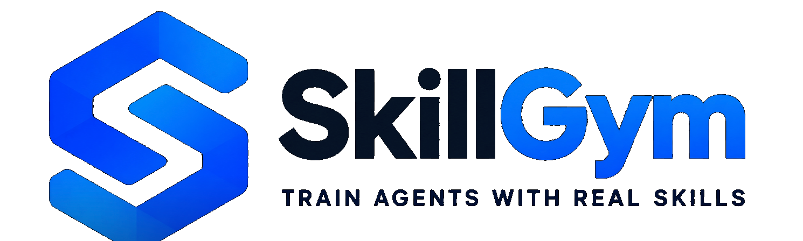

  <picture>
    <source media="(prefers-color-scheme: dark)" srcset="assets/skillgym_brand_dark.png">
    <source media="(prefers-color-scheme: light)" srcset="assets/skillgym_brand_light.png">
    
  </picture>

<strong>Internalizing Large-Scale Human-Written Skills into LLMs for Real-World Problem Solving</strong>

  
  
  
  
  

  <a href="assets/Internalizing_Large_Scale_Human_Written_Skills_into_LLMs_for_Real_World_Problem_Solving.pdf">Paper</a>
  &nbsp;&nbsp;•&nbsp;&nbsp;
  <a href="https://huggingface.co/datasets/ecnu-icalk/SkillGym">Dataset</a>
  &nbsp;&nbsp;•&nbsp;&nbsp;
  <a href="https://huggingface.co/ecnu-icalk/SkillGym-Agent">Model</a>
  &nbsp;&nbsp;•&nbsp;&nbsp;
  <a href="task_builder/README.md">Task Builder</a>
  &nbsp;&nbsp;•&nbsp;&nbsp;
  <a href="#quick-start">Quick Start</a>

<em>From human-written skills to verified agent experience, and from verified experience to reusable model capability.</em>

  

<em>SkillGym turns human-written skills into executable and verifiable task environments, measures skill dependence with paired execution, and collects successful long-horizon trajectories for agent training.</em>

## Overview

Large language model agents can follow external skill documents, but a more fundamental question is whether repeated, verified use of those skills can become **reusable capability inside the model itself**.

**SkillGym** provides an end-to-end framework for studying this question. It transforms human-written skills into executable environments, validates task outcomes with code-based verifiers, contrasts execution **with and without the target skill**, and converts successful long-horizon interactions into training data.

> **Research question.** Can verified experience generated from human-written skills be internalized as transferable agent capability?

### Contributions

- **Skill-grounded environment construction.** SkillGym converts human-written procedural knowledge into executable tasks with explicit runtime and verification specifications.
- **Paired skill-dependence evaluation.** Every eligible task can be executed with and without its target skill, separating direct skill following from capability that survives skill removal.
- **Verified long-horizon training experience.** Successful trajectories are collected only after environment-level verification and used to train **SkillGym-Agent**.
- **Open resources.** We release the task-construction pipeline, dataset, trajectories, and trained checkpoint.

## At a Glance

<table>
  <tr>
    <td align="center" width="25%"><strong>2,756</strong> accepted environments</td>
    <td align="center" width="25%"><strong>5,512</strong> paired task variants</td>
    <td align="center" width="25%"><strong>8,364</strong> successful trajectories</td>
    <td align="center" width="25%"><strong>12 / 63</strong> major / sub-categories</td>
  </tr>
</table>

Counts correspond to the current manuscript snapshot. Environments, paired variants, sampled trials, and successful trajectories are different units.

## Main Results

  

<em>General-agent benchmark results from the current manuscript. Click the figure for the vector PDF.</em>

**SkillGym-Agent** is a full-parameter supervised fine-tuned Qwen3.5-35B-A3B model trained on successful SkillGym trajectories.

| Harness | Model | GDPval-AA v2 ↑ | Terminal-Bench 2.1 ↑ | SkillsBench v1.1 ↑ | w/o Skills ↑ |
| --- | --- | ---: | ---: | ---: | ---: |
| Codex | Qwen3.5-35B-A3B | 942 | 10.11 | 5.33 | 0.69 |
| Codex | **SkillGym-Agent** | **979 (+37)** | **46.07 (+35.96)** | **33.02 (+27.69)** | **21.08 (+20.39)** |
| Claude Code | Qwen3.5-35B-A3B | 974 | 39.33 | 23.34 | 12.13 |
| Claude Code | **SkillGym-Agent** | **1173 (+199)** | **58.43 (+19.10)** | **51.47 (+28.13)** | **26.81 (+14.68)** |

Parenthesized values are absolute Elo or percentage-point gains over the same-harness base model.

### Skill-free transfer

A central result is the performance that remains after removing the inference-time skill:

> Under **Claude Code**, SkillGym-Agent reaches **26.81% without skills**, compared with **23.34%** for the base model **with skills**. Under **Codex**, the corresponding comparison is **21.08% vs. 5.33%**.

This pattern is consistent with part of the verified workflow experience transferring beyond direct prompt following. Performance is still strongest when external skills remain available, suggesting that **internalized capability and explicit skills are complementary**.

## How SkillGym Works

<table>
<tr>
<td width="20%" align="center"><strong>1. Ground</strong> Skills & templates</td>
<td width="20%" align="center"><strong>2. Build</strong> Executable tasks</td>
<td width="20%" align="center"><strong>3. Verify</strong> Code-based checks</td>
<td width="20%" align="center"><strong>4. Contrast</strong> With vs. without skill</td>
<td width="20%" align="center"><strong>5. Learn</strong> Verified trajectories</td>
</tr>
</table>

A task enters the strict **Skill-Dep** group when the <code>with_skill</code> execution succeeds while the paired <code>no_skill</code> execution produces a valid reward failure. Other verifier-passed environments are released separately as **Verifier-Passed** tasks.

For implementation details, repair semantics, validation stages, and output layout, see the [task-generation pipeline](task_builder/docs/task-generation-pipeline.md).

## Resources

| Resource | Description | Link |
| --- | --- | --- |
| **SkillGym Dataset** | Skills, task templates, executable environments, and trajectories | [Hugging Face](https://huggingface.co/datasets/ecnu-icalk/SkillGym) |
| **SkillGym-Agent** | Checkpoint trained on successful SkillGym trajectories | [Hugging Face](https://huggingface.co/ecnu-icalk/SkillGym-Agent) |
| **Task Builder** | Pipeline for constructing new skill-grounded environments | [Developer Guide](task_builder/README.md) |
| **Pipeline Docs** | Full task-generation and validation workflow | [Documentation](task_builder/docs/task-generation-pipeline.md) |
| **Paper** | Current manuscript | [PDF](assets/Internalizing_Large_Scale_Human_Written_Skills_into_LLMs_for_Real_World_Problem_Solving.pdf) |

## Quick Start

### Download trajectories

~~~bash
python -m pip install -U huggingface_hub

hf download ecnu-icalk/SkillGym \
  --include "Trajectories/*.jsonl" \
  --repo-type dataset \
  --local-dir .hf/skillgym
~~~

Stream a trajectory collection directly:

~~~python
from datasets import load_dataset

trajectories = load_dataset(
    "json",
    data_files={
        "train": (
            "hf://datasets/ecnu-icalk/SkillGym/"
            "Trajectories/skill_dependent_claude_code_deepseek_v4_pro.jsonl"
        )
    },
    split="train",
    streaming=True,
)

print(next(iter(trajectories))["session_id"])
~~~

### Download SkillGym-Agent

~~~bash
hf download ecnu-icalk/SkillGym-Agent \
  --local-dir .hf/skillgym-agent
~~~

### Build a task family

~~~bash
git clone https://github.com/ECNU-ICALK/SkillGym.git
cd SkillGym

npm --prefix task_builder ci
npm --prefix task_builder run check
~~~

Download the released skill library and task templates:

~~~bash
hf download ecnu-icalk/SkillGym \
  skill_library.tar.zst task_templates.tar.zst \
  --repo-type dataset \
  --local-dir .hf/skillgym

tar --zstd -xf .hf/skillgym/skill_library.tar.zst
tar --zstd -xf .hf/skillgym/task_templates.tar.zst
~~~

Generate one small task family:

~~~bash
npm --prefix task_builder run generate-family -- \
  --template-root task_templates \
  --template development/frontend/seed_task \
  --skill-dir skill_library/development/frontend/skills/tailwind-design-system \
  --skill-mode per-skill \
  --task-count 1 \
  --output-root /tmp/skillgym-output \
  --concurrency 1
~~~

> [!NOTE]
> Full task generation additionally requires Harbor, a configured runtime such as E2B, Daytona, or Docker, and the relevant model/runtime credentials. See the [Task Builder guide](task_builder/README.md) before scaling up.

<strong>Dataset and release details</strong>

 

| Release signal | Value |
| --- | --- |
| Accepted environments | **2,756** |
| Skill-Dep / Verifier-Passed | **1,081 / 1,675** |
| Successful trajectories | **8,364** from 48,152 trials |
| Trial-level success rate | **17.4%** |
| Deduplicated coverage | **2,302** unique tasks |
| Average successful trajectory | **49.0** tool calls · **63.4k** logged text tokens · **35.2** interaction steps |
| Longest observed trajectory | **350** tool calls · **342.9k** logged text tokens · **318** interaction steps |

| Artifact | Contents |
| --- | --- |
| <code>Tasks.tar.zst</code> | Published paired task environments |
| <code>skill_library.tar.zst</code> | Human-written skills and supporting assets |
| <code>task_templates.tar.zst</code> | Reusable seed task templates and fixtures |
| <code>Trajectories/*.jsonl</code> | Trajectory collections by result type, harness, and teacher |
| <code>SkillGym-Agent</code> | Released trained checkpoint |

The large-artifact snapshot is associated with GitHub commit <code>6ebabba</code>. For schema details, task layout, licensing notes, and intended use, see the [Hugging Face Dataset Card](https://huggingface.co/datasets/ecnu-icalk/SkillGym).

<strong>Teacher and harness ablation</strong>

 

| Harness | Teacher setting | GDPval-AA v2 | Terminal-Bench 2.1 | SkillsBench v1.1 | w/o Skills |
| --- | --- | ---: | ---: | ---: | ---: |
| Codex | GPT-5.4 | 969 | 24.72 | 14.00 | 6.96 |
| Codex | Nex-N2-Pro | 1074 | 33.71 | 13.59 | 12.61 |
| Codex | GPT+Nex | 976 | 40.45 | 19.91 | 13.59 |
| Codex | **All Teachers** | **979** | **46.07** | **33.02** | **21.08** |
| Claude Code | DeepSeek V4 Pro | 1106 | 43.82 | 28.81 | 19.02 |
| Claude Code | GLM-5.2 | **1212** | 55.06 | 45.50 | 25.10 |
| Claude Code | DeepSeek+GLM | 1161 | 57.30 | 47.33 | **28.41** |
| Claude Code | **All Teachers** | 1173 | **58.43** | **51.47** | 26.81 |

<strong>Evaluation and reproducibility notes</strong>

 

- **GDPval-AA v2** is reported as Elo. **Terminal-Bench 2.1** and **SkillsBench v1.1** are reported as task success rates (%).
- The manuscript reports long-context full-parameter SFT with ms-swift/Megatron on 16 NVIDIA H200 GPUs.
- The repository releases the Task Builder, data, trajectories, and checkpoint, but does not currently include standalone training or full benchmark-reproduction scripts.
- Claude Code uses the same standard system prompt for the base and trained models. In the Codex comparison, the base model uses the standard prompt while SkillGym-Agent uses the no-applypatch prompt; the Codex difference therefore should not be attributed to fine-tuning alone.
- Public reference scores may use different harnesses, inference budgets, runtime configurations, and model versions.

See the [manuscript](assets/Internalizing_Large_Scale_Human_Written_Skills_into_LLMs_for_Real_World_Problem_Solving.pdf) for complete evaluation details.

## Citation

The accompanying paper is currently under double-blind review. Until final publication metadata is available, please use the provisional project citation:

~~~bibtex
@misc{skillgym,
  title = {SkillGym: Internalizing Human Skills into LLMs for Real-World Problem Solving},
  year  = {2026},
  note  = {Under review at ICLR 2027},
  url   = {https://github.com/ECNU-ICALK/SkillGym}
}
~~~

## License

Repository-level code and materials are released under the [MIT License](LICENSE).

Dataset source skills, fixtures, and supporting assets may retain upstream notices or additional licensing terms. Preserve those notices when redistributing the corresponding materials.
