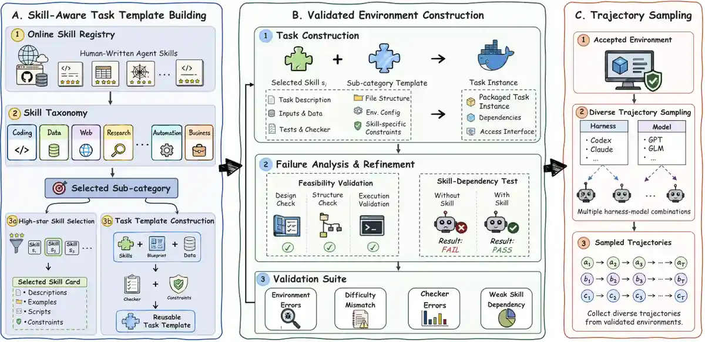

# SkillGym: Internalizing Human Skills into LLMs for Real-World Problem Solving

*Turning human-written agent skills into executable, verifiable training environments and reusable procedural capabilities.*

<p align="center">
  <b>Paper:</b> coming soon &nbsp;·&nbsp;
  <a href="https://huggingface.co/datasets/ecnu-icalk/SkillGym">Dataset</a> &nbsp;·&nbsp;
  <b>Models:</b> coming soon &nbsp;·&nbsp;
  <a href="#experimental-results">Results</a> &nbsp;·&nbsp;
  <a href="#quick-start">Quick Start</a> &nbsp;·&nbsp;
  <a href="docs/task-generation-pipeline.md">Task Construction</a>
</p>

SkillGym converts reusable human-written agent skills into task environments with concrete inputs, runtime configuration, and code-based outcome verifiers. The current manuscript reports **2,756 accepted environments** and **8,364 successful long-horizon trajectories**, which provide verified workflow demonstrations for supervised fine-tuning.

<p align="center">
  <a href="assets/skillgym_baseline.pdf">
    
  </a>
</p>

*Figure 1. General-agent benchmark performance reported in the current manuscript. The four panels show GDPval-AA v2, Terminal-Bench 2.1, SkillsBench v1.1 with skills, and SkillsBench v1.1 without skills. Click the figure for the original PDF; exact values and evaluation caveats are listed in [Experimental Results](#experimental-results).*

## Framework



**A. Skill-aware task template building.** Human-written skills are organized into a taxonomy and represented as skill cards. Sub-category templates define reusable task structures, runtime requirements, and verification specifications.

**B. Validated environment construction.** Skills and templates are instantiated as executable environments. Feasibility checks, code-based verification, and contrastive runs with and without the target skill guide failure analysis and refinement.

**C. Trajectory sampling.** Multiple model–harness combinations interact with accepted environments to collect successful long-horizon workflows for supervised fine-tuning.

The current paper reports supervised fine-tuning results. Reinforcement learning with verifier-derived rewards is a future direction, not a released training recipe.

## Dataset at a Glance

| Resource | Paper-reported scope |
| --- | ---: |
| Accepted task environments | 2,756 |
| Taxonomy | 12 major categories / 63 sub-categories |
| Skill-Dep. environments | 1,081 |
| Verifier-Passed fallback environments | 1,675 |
| Successful trajectories | 8,364 |
| Unique tasks covered by successful trajectories | 2,302 |
| Sub-categories covered by successful trajectories | 62 |
| Average tool calls per successful trajectory | 49 |
| Average logged text per successful trajectory | Over 60k tokens |

Source: manuscript Abstract, Section 4, and Tables 1–2. Task environments, with/without-skill variants, sampled trials, and saved trajectories are different counting units. Logged text tokens do not represent API usage or a single-request context length.

**Skill-Dep.** means that a feasible, verifier-passed task was solved with the target skill but not without it under the reference configuration. **Verifier-Passed** environments satisfy execution and outcome-verification checks without that additional contrastive evidence. These are construction-time labels, not guarantees about every subsequent agent execution.

<details>
<summary>Successful trajectories by teacher and harness</summary>

| Harness | Teacher | Successful trajectories |
| --- | --- | ---: |
| Claude Code | DeepSeek V4 Pro | 1,722 |
| Claude Code | GLM-5.2 | 1,769 |
| Codex | GPT-5.4 | 1,967 |
| Codex | Nex-N2-Pro | 2,906 |
| **Total** | | **8,364** |

Source: manuscript Table 2. Pooling teachers covers more tasks than any individual sampling group; these rows are not a matched-task comparison of teacher efficiency.

</details>

## Experimental Results

Figure 1 above provides the visual overview; the tables below preserve the exact manuscript-reported values and evaluation caveats.

The student backbone is **Qwen3.5-35B-A3B**. GDPval-AA v2 is reported in **Elo**; Terminal-Bench 2.1 and SkillsBench v1.1 are reported as **task success rates (%)**. Parenthesized improvements are absolute Elo points or percentage points, not relative percentages.

### Comparison with the Base Model

| Harness | Model | GDPval-AA v2 ↑ | Terminal-Bench 2.1 ↑ | SkillsBench v1.1 w/ Skills ↑ | SkillsBench v1.1 w/o Skills ↑ |
| --- | --- | ---: | ---: | ---: | ---: |
| Codex | Qwen3.5-35B-A3B (Base) | 942 | 10.11 | 5.33 | 0.69 |
| Codex | **SkillGym-Agent** | **976 (+34)** | **40.45 (+30.34)** | **19.91 (+14.58)** | **13.59 (+12.90)** |
| Claude Code | Qwen3.5-35B-A3B (Base) | 974 | 39.33 | 23.34 | 12.13 |
| Claude Code | **SkillGym-Agent** | **1161 (+187)** | **57.30 (+17.97)** | **47.33 (+23.99)** | **28.41 (+16.28)** |

Source: manuscript Table 4. Under Claude Code, the base and trained models use the same standard system prompt. Under Codex, the base uses the standard prompt while SkillGym-Agent uses the `no-applypatch` prompt; the Codex difference therefore cannot be attributed solely to fine-tuning. The manuscript describes the evaluation setup and task selection in Section 5.1 and Appendix C, including the exclusion of five Terminal-Bench Science tasks requiring Docker Compose.

<details>
<summary>Comparable-scale agent baselines</summary>

| Model | GDPval-AA v2 ↑ | Terminal-Bench 2.1 ↑ | SkillsBench v1.1 w/ Skills ↑ | SkillsBench v1.1 w/o Skills ↑ |
| --- | ---: | ---: | ---: | ---: |
| TerminalTraj-32B | 164 | 28.50 | 0.00 | 0.00 |
| OpenThinkerAgent-32B | 751 | 30.70 | 2.30 | 1.15 |
| Nemotron-Terminal-32B | 455 | 27.90 | 0.00 | 0.00 |
| Agents-A1 | 984 | 43.82 | 30.29 | 13.37 |

Source: manuscript Table 13. The same-backbone comparisons are shown separately above; other baselines do not constitute a fine-tuning-only ablation.

</details>

<details>
<summary>Public reference models reported in the manuscript</summary>

| Model | GDPval-AA v2 ↑ | Terminal-Bench 2.1 ↑ | SkillsBench v1.1 w/ Skills ↑ | SkillsBench v1.1 w/o Skills ↑ |
| --- | ---: | ---: | ---: | ---: |
| MiniMax-M2.7 | 1087 | 55.4 | 34.9 | 18.1 |
| MiniMax-M3 | 1304 | 66.0 | 53.0 | 29.7 |
| Claude Sonnet 4.6 | 1295 | 58.5 | 47.2 | 33.5 |
| Claude Opus 4.8 | 1489 | 74.6 | 54.1 | 45.7 |
| GPT-5.4 Mini | 1095 | 66.1 | 41.4 | 29.9 |
| GPT-5.4 | 1307 | 77.3 | — | — |
| GLM-5.1 | 1180 | 58.7 | 58.4 | 32.7 |
| Gemini 3.1 Pro | 904 | 70.7 | 60.8 | 36.0 |
| DeepSeek-V4-Pro-0813 | 1493 | 87.9 | — | — |
| DeepSeek V4 Pro (Preview) | 1223 | 72.1 | 50.1 | 26.9 |
| Nex-N2-Pro | 1175 | 75.3 | — | — |

Source: manuscript Table 13 and Appendix C. These are manuscript-snapshot reference scores, not a fresh verification of public leaderboards. Harnesses, inference budgets, runtime environments, and evaluation configurations may differ, so the rows are contextual references rather than strictly controlled head-to-head comparisons. An em dash means that the manuscript does not report a verified score for the exact setting; it does not mean zero. Preview and later DeepSeek checkpoints are kept separate.

</details>

<details>
<summary>Teacher-model ablation</summary>

| Student harness | Teacher setting | GDPval-AA v2 ↑ | Terminal-Bench 2.1 ↑ | SkillsBench v1.1 w/ Skills ↑ | SkillsBench v1.1 w/o Skills ↑ |
| --- | --- | ---: | ---: | ---: | ---: |
| Codex | GPT-5.4 | 969 | 24.72 | 14.00 | 6.96 |
| Codex | Nex-N2-Pro | 1074 | 33.71 | 13.59 | 12.61 |
| Codex | Both | 976 | 40.45 | 19.91 | 13.59 |
| Claude Code | DeepSeek V4 Pro | 1106 | 43.82 | 28.81 | 19.02 |
| Claude Code | GLM-5.2 | 1212 | 55.06 | 45.50 | 25.10 |
| Claude Code | Both | 1161 | 57.30 | 47.33 | 28.41 |

Source: manuscript Table 5. “Both” refers to the two teachers listed for the corresponding harness, not all four teachers. Mixed-teacher supervision improves the three execution-oriented metrics over the best single-teacher setting, but not GDPval-AA Elo. The manuscript's unfinished All Teachers / Full entries are not reported as completed experiments.

</details>

## Data and Release Status

The companion dataset repository is **[ecnu-icalk/SkillGym](https://huggingface.co/datasets/ecnu-icalk/SkillGym)**. Large release artifacts are distributed there so that the GitHub repository stays focused on code, documentation, and lightweight assets.

| Component | Location / status |
| --- | --- |
| Skill library | [HF archive: `skill_library.tar.zst`](https://huggingface.co/datasets/ecnu-icalk/SkillGym/blob/main/skill_library.tar.zst); extract to `skill_library/` |
| Task templates | [HF archive: `task_templates.tar.zst`](https://huggingface.co/datasets/ecnu-icalk/SkillGym/blob/main/task_templates.tar.zst); extract to `task_templates/` |
| Environment construction code | [`task_builder/`](task_builder/) |
| Task-environment dataset | [Hugging Face dataset](https://huggingface.co/datasets/ecnu-icalk/SkillGym) |
| Existing trajectory JSONL files | [`Trajectories/`](Trajectories/), tracked with Git LFS and retained in GitHub |
| Standalone sampling, SFT and benchmark-reproduction recipes | Release pending |
| Model checkpoints | Release pending |
| arXiv and finalized citation metadata | Coming soon |

The two directory archives were created from GitHub commit [`6ebabba`](https://github.com/ECNU-ICALK/SkillGym/commit/6ebabba67ca449cb04c87085a30fe78096eb99b3). Their checksums and sizes are recorded in the HF [`migration_manifest.json`](https://huggingface.co/datasets/ecnu-icalk/SkillGym/blob/main/migration_manifest.json). The trajectory files are intentionally outside this migration and remain available through Git LFS.


## Repository Layout

```text
SkillGym/
├── README.md
├── task_builder/         # TypeScript construction, validation, and repair pipeline
│   ├── src/
│   ├── tests/
│   ├── package.json
│   └── package-lock.json
├── Trajectories/         # Existing Git LFS files; retained during this migration
├── assets/               # Framework illustration
├── docs/                 # Construction and migration notes
└── .github/workflows/    # Lightweight builder checks
```

The large `skill_library/` and `task_templates/` trees are released as HF archives and recreated locally by the Quick Start commands. See [migration notes](docs/migration.md) for the release layout and path behavior.

## Quick Start

### Download the data archives

Clone the code repository without downloading trajectory LFS objects, then download and extract the two large directory archives from Hugging Face:

```bash
GIT_LFS_SKIP_SMUDGE=1 git clone https://github.com/ECNU-ICALK/SkillGym.git
cd SkillGym

python -m pip install -U huggingface_hub
hf auth login
hf download ecnu-icalk/SkillGym \
  skill_library.tar.zst task_templates.tar.zst \
  --repo-type dataset --local-dir .hf/skillgym
tar --zstd -xf .hf/skillgym/skill_library.tar.zst
tar --zstd -xf .hf/skillgym/task_templates.tar.zst

npm --prefix task_builder ci
npm --prefix task_builder run check
npm --prefix task_builder run inventory
```

The extraction commands recreate `skill_library/` and `task_templates/` at the repository root. The archives are pinned to the source commit recorded in [`migration_manifest.json`](https://huggingface.co/datasets/ecnu-icalk/SkillGym/blob/main/migration_manifest.json). Trajectories are still separate: install Git LFS and run `git lfs pull --include="Trajectories/*.jsonl"` only when you need those files.

### Configure Task Generation

Create `.env` from `.env.example` only when a local `.env` does not already exist, then fill in the credentials and endpoint settings required by your provider and runtime:

```bash
[ -f .env ] || cp .env.example .env
# Edit .env before continuing.
set -a
source .env
set +a
```

The existing example configuration contains:

```bash
OPENAI_API_KEY=
OPENAI_BASE_URL=
E2B_API_KEY=
CODEX_TASK_BUILDER_RUNTIME_ENV=e2b
```

The builder uses the Codex SDK and an external runtime/validation setup. Installing npm dependencies alone does not provision a sandbox or model access. See [the construction guide](docs/task-generation-pipeline.md) and the runtime preflight messages for the environment used by the existing implementation.

### Generate One Task

From the repository root:

```bash
cd task_builder

npm run generate-family -- \
  --template-root ../task_templates \
  --template development/frontend/seed_task \
  --skill-dir ../skill_library/development/frontend/skills/tailwind-design-system \
  --skill-mode per-skill \
  --task-count 1 \
  --output-root /tmp/skillgym-output/development/frontend \
  --concurrency 1 \
  --codex-run-retries 3 \
  --task-attempt-timeout-hours 9 \
  --max-task-restarts 0 \
  --max-pre-runtime-repair-rounds 100 \
  --max-runtime-repair-rounds 100 \
  --max-skill-effect-repair-rounds 100
```

This retains the previous example's construction budgets. A generation run can take hours and invoke paid model and sandbox services; review these limits before execution. This example constructs a task, not the full paper dataset or a reproduction of the training experiments.

## Development Checks

```bash
cd task_builder
npm run check
npm run test:codex
npm run test:prompts
npm run test:validate
npm run test:skill-effect
node --import tsx tests/harbor_metrics.test.ts
node --import tsx tests/repo_paths.test.ts
```

The path regression test checks resource discovery from the repository root, the builder directory, an unrelated working directory, and an explicit external template root. These checks do not run a paid end-to-end generation job or reproduce benchmark scores.

## Citation

The arXiv link, author metadata, and finalized BibTeX entry will be added with the paper release.

## License

See [LICENSE](LICENSE) for the repository license. Source skills and supporting materials retain their applicable upstream notices; this refactor does not change their licensing or provenance.
