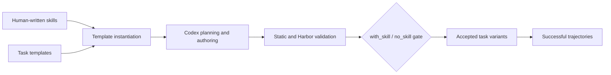

<div align="center">

<h1>🧠 SkillGym</h1>

<p><strong>Internalizing Large-Scale Human-Written Skills into LLMs for Real-World Problem Solving</strong></p>

<p><em>From human-written workflows to executable, verifiable training environments.</em></p>

<p>
  🤗 <a href="https://huggingface.co/datasets/ecnu-icalk/SkillGym">Dataset</a>
  &nbsp;·&nbsp;
  🤖 <a href="https://huggingface.co/ecnu-icalk/SkillGym-Agent">Model checkpoint</a>
  &nbsp;·&nbsp;
  🧰 <a href="task_builder/README.md">Task Builder</a>
  &nbsp;·&nbsp;
  🧭 <a href="task_builder/docs/task-generation-pipeline.md">Pipeline</a>
  &nbsp;·&nbsp;
  🚀 <a href="#quick-start">Quick start</a>
</p>

</div>

> **SkillGym** transforms human-written agent skills into executable environments, verifies outcomes with code, and collects successful long-horizon trajectories for training general-purpose agents.

## 📌 At a glance

<table>
  <tr>
    <td align="center">🏗️<br><strong>2,756</strong><br><sub>accepted environments</sub></td>
    <td align="center">🧪<br><strong>5,512</strong><br><sub>with-skill / no-skill variants</sub></td>
    <td align="center">🧵<br><strong>8,364</strong><br><sub>successful trajectories</sub></td>
    <td align="center">🗂️<br><strong>12 / 63</strong><br><sub>major / sub-categories</sub></td>
  </tr>
</table>

<p><sub>Counts are the current manuscript snapshot. Environments, variants, sampled trials, and trajectories are different units; see the <a href="Internalizing_Large_Scale_Human_Written_Skills_into_LLMs_for_Real_World_Problem_Solving.pdf">manuscript PDF</a> for the evaluation protocol.</sub></p>

<p align="center">
  <a href="assets/skillgym_baseline.pdf">
    
  </a>
</p>

<p align="center"><em>Benchmark overview from the current manuscript. Click the figure to open the PDF version.</em></p>

## 🧩 Framework

<p align="center">
  <a href="assets/SkillGym.pdf">
    
  </a>
</p>

<p align="center"><em>SkillGym converts human-written skills into executable, verifiable environments, then samples successful trajectories across multiple harness-model combinations.</em></p>

## 📊 Key experimental results

SkillGym-Agent is a supervised fine-tuned Qwen3.5-35B-A3B model trained on successful SkillGym trajectories. The table reports the same-harness comparison from the manuscript: GDPval-AA v2 is Elo, while the other columns are task success rates (%).

| Harness | Model | GDPval-AA v2 | Terminal-Bench 2.1 | SkillsBench v1.1 (with skills) | SkillsBench v1.1 (without skills) |
| --- | --- | ---: | ---: | ---: | ---: |
| Codex | Qwen3.5-35B-A3B (base) | 942 | 10.11 | 5.33 | 0.69 |
| Codex | **SkillGym-Agent** | **976 (+34)** | **40.45 (+30.34)** | **19.91 (+14.58)** | **13.59 (+12.90)** |
| Claude Code | Qwen3.5-35B-A3B (base) | 974 | 39.33 | 23.34 | 12.13 |
| Claude Code | **SkillGym-Agent** | **1161 (+187)** | **57.30 (+17.97)** | **47.33 (+23.99)** | **28.41 (+16.28)** |

SkillGym-Agent improves every reported metric under both harnesses. The largest professional-task gain appears under Claude Code (+187 Elo), while Codex shows the larger Terminal-Bench gain (+30.34 points). The Claude Code comparison uses the same standard system prompt for base and trained models; the Codex comparison also changes the system prompt, so its improvement should not be attributed to fine-tuning alone. See the [manuscript PDF](assets/Internalizing_Large_Scale_Human_Written_Skills_into_LLMs_for_Real_World_Problem_Solving.pdf) and the [benchmark figure](assets/skillgym_baseline.pdf) for the full setup and caveats.

## 🧭 Explore the release

| I want to… | Start here |
| --- | --- |
| 📖 Read the project overview | This page |
| 📦 Download published environments and trajectories | [HF dataset](https://huggingface.co/datasets/ecnu-icalk/SkillGym) |
| 🧰 Build new task environments | [Task Builder guide](task_builder/README.md) |
| 🧭 Understand the complete construction flow | [Task-generation pipeline](task_builder/docs/task-generation-pipeline.md) |
| 🤖 Download the released checkpoint | [SkillGym-Agent on Hugging Face](https://huggingface.co/ecnu-icalk/SkillGym-Agent) |
| 🗃️ Understand the data migration and archive layout | [Migration notes](docs/migration.md) |

## 🔄 How SkillGym works



1. **Represent skills.** Skills are organized into a taxonomy and stored as reusable skill cards.
2. **Instantiate tasks.** A template combines a skill with concrete inputs, runtime requirements, and a verification specification.
3. **Validate behavior.** Static checks, Harbor execution, oracle runs, and with-skill/no-skill comparisons identify valid environments.
4. **Collect demonstrations.** Multiple teacher and harness configurations produce successful long-horizon trajectories.

The strict skill-effect gate requires the with-skill run to pass while the no-skill run produces a valid reward failure. Other verifier-passed outcomes can be retained as fallback releases after repair budgets are exhausted. These labels describe construction-time checks; they are not guarantees for every later agent execution.

## 📦 Release contents

Large artifacts live in the companion [Hugging Face dataset](https://huggingface.co/datasets/ecnu-icalk/SkillGym) so that this GitHub repository stays focused on code, documentation, and lightweight figures.

| Artifact | Purpose | Where to get it |
| --- | --- | --- |
| `Tasks.tar.zst` | Published task-environment archive, including `Tasks/Skill-Dep` and `Tasks/Verifier-Passed` | [HF file](https://huggingface.co/datasets/ecnu-icalk/SkillGym/blob/main/Tasks.tar.zst) |
| `skill_library.tar.zst` | Input skill cards for task generation | [HF file](https://huggingface.co/datasets/ecnu-icalk/SkillGym/blob/main/skill_library.tar.zst) |
| `task_templates.tar.zst` | Input templates for task generation | [HF file](https://huggingface.co/datasets/ecnu-icalk/SkillGym/blob/main/task_templates.tar.zst) |
| `Trajectories/*.jsonl` | Eight successful trajectory collections grouped by harness, teacher, and result type | [HF directory](https://huggingface.co/datasets/ecnu-icalk/SkillGym/tree/main/Trajectories) |
| SkillGym-Agent | Released model checkpoint | [HF model](https://huggingface.co/ecnu-icalk/SkillGym-Agent) |

The archives and trajectory files are a data snapshot associated with GitHub commit `6ebabba`. The current GitHub code can evolve independently from that snapshot. File sizes and SHA-256 checksums are available from the corresponding Hugging Face file metadata.

<a id="quick-start"></a>
## 🚀 Quick start

### 1. Check the builder

```bash
git clone https://github.com/ECNU-ICALK/SkillGym.git
cd SkillGym

npm --prefix task_builder ci
npm --prefix task_builder run check
```

### 2. Download the builder inputs

This downloads the skill cards and templates needed by `task_builder`. It does not download the 9 GB published task archive.

```bash
python -m pip install -U huggingface_hub
hf auth login

hf download ecnu-icalk/SkillGym \
  skill_library.tar.zst task_templates.tar.zst \
  --repo-type dataset --local-dir .hf/skillgym

tar --zstd -xf .hf/skillgym/skill_library.tar.zst
tar --zstd -xf .hf/skillgym/task_templates.tar.zst
```

### 3. Download published environments (optional)

```bash
hf download ecnu-icalk/SkillGym Tasks.tar.zst \
  --repo-type dataset --local-dir .hf/skillgym

tar --zstd -xf .hf/skillgym/Tasks.tar.zst
```

### 4. Generate a task family

The full command, configuration variables, repair budgets, runtime requirements, and output semantics are documented in the [Task Builder guide](task_builder/README.md). A minimal example is:

```bash
cd task_builder

npm run generate-family -- \
  --template-root ../task_templates \
  --template development/frontend/seed_task \
  --skill-dir ../skill_library/development/frontend/skills/tailwind-design-system \
  --skill-mode per-skill \
  --task-count 1 \
  --output-root /tmp/skillgym-output \
  --concurrency 1
```

A generation run may take hours and can invoke paid model and sandbox services. Installing npm dependencies alone does not provision Harbor, a runtime, or model credentials.

## 📄 Experiments and paper

The figure above is a compact visual summary of the current manuscript. The [manuscript PDF](assets/Internalizing_Large_Scale_Human_Written_Skills_into_LLMs_for_Real_World_Problem_Solving.pdf) contains the benchmark tables, ablations, task-selection rules, and evaluation caveats. Reported scores are manuscript snapshots and should not be interpreted as a continuously updated leaderboard.

The released repository does not yet include standalone scripts for reproducing the complete SFT run or every benchmark harness. The task builder and data artifacts are released; training and evaluation recipes remain separate follow-up work.

## 📚 Citation

The final arXiv link and BibTeX entry will be added with the paper release.

## ⚖️ License

See [LICENSE](LICENSE) for the repository license. Source skills and supporting materials retain their applicable upstream notices; this documentation refactor does not change their licensing or provenance.
