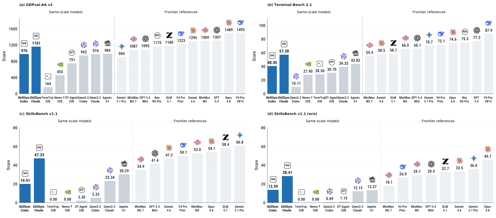
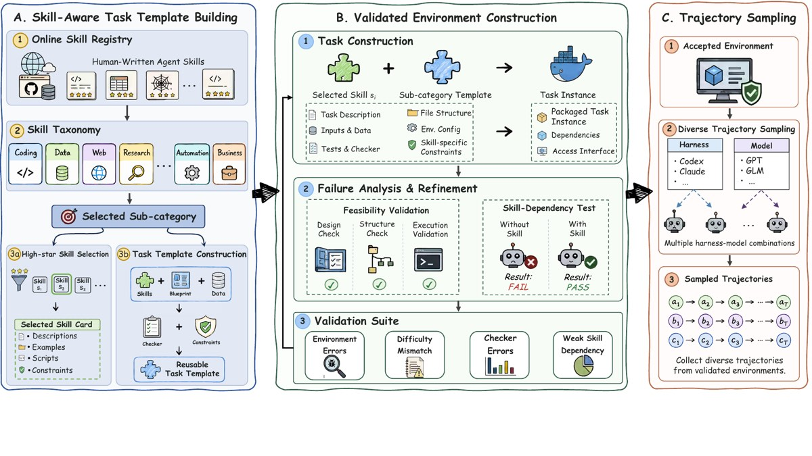

<p align="center">
  <picture>
    <source media="(prefers-color-scheme: dark)" srcset="assets/brand-dark.png">
    <source media="(prefers-color-scheme: light)" srcset="assets/brand-light.png">
    
  </picture>
</p>

<div align="center">

<strong>Internalizing large-scale human-written skills into LLMs for real-world problem solving</strong>

[](assets/Internalizing_Large_Scale_Human_Written_Skills_into_LLMs_for_Real_World_Problem_Solving.pdf)
[](https://huggingface.co/datasets/ecnu-icalk/SkillGym)
[](https://huggingface.co/ecnu-icalk/SkillGym-Agent)
[](LICENSE)

[Task Builder](task_builder/README.md) · [Documentation](task_builder/docs/task-generation-pipeline.md) · [Quick Start](#quick-start)

</div>

**SkillGym** converts human-written skills into executable, verifier-backed training environments and verified long-horizon agent trajectories, enabling the study of whether external procedural knowledge can become reusable capability inside an LLM agent.

> **Core question:** Can verified experience generated from human-written skills become reusable procedural competence inside the model?

<p align="center">
  <a href="assets/skillgym_baseline.pdf">
    
  </a>
</p>

<div align="center">

**Navigate:**  
[Framework](#framework) ·
[Contributions](#contributions) ·
[Dataset](#dataset-at-a-glance) ·
[Results](#main-results) ·
[Resources](#project-resources) ·
[Quick Start](#quick-start) ·
[Reproducibility](#release--reproducibility) ·
[Citation](#citation)

</div>

> **Key takeaway.** Across the reported evaluations, SkillGym-Agent scores higher than the same-backbone base on GDPval-AA v2, Terminal-Bench 2.1, and SkillsBench v1.1 under both evaluated harnesses. Its skill-free score also exceeds the skill-assisted base in both harnesses, suggesting that part of the verified workflow experience transfers beyond direct access to external skills.

The framework below shows how SkillGym turns human-written skills into executable environments, verifier-backed interaction experience, and training trajectories for agent capability acquisition.

## Framework

<p align="center">
  <a href="assets/SkillGym.pdf">
    
  </a>
</p>

<p align="center">
  <sub><em>From human-written skills to executable environments, verifier-backed experience, and reusable agent capability.</em></sub>
</p>

## Contributions

- **SkillGym framework.** Human-written agent skills are transformed into executable, verifier-backed training environments rather than being used only as inference-time instructions.
- **Contrastive skill-dependency validation.** Paired with-skill / without-skill execution identifies environments whose success depends on the target procedural knowledge under the reference construction setup.
- **Large-scale verified experience.** The release connects accepted environments, task-specific verifiers, and successful long-horizon trajectories across a broad procedural taxonomy.
- **Multi-harness trajectory collection.** Execution experience is sampled across multiple harness–model configurations instead of relying on a single agent setup.
- **Skill internalization study.** SkillGym-Agent tests whether verified workflow experience can become reusable model capability, including when external skills are removed at inference time.

## Dataset at a Glance

<table>
  <tr>
    <td align="center" width="25%">
      <sub><strong>ACCEPTED ENVIRONMENTS</strong></sub><br>
      <strong>2,756</strong><br>
      <sub>executable and verifier-passed</sub>
    </td>
    <td align="center" width="25%">
      <sub><strong>SKILL-DEPENDENT</strong></sub><br>
      <strong>1,081</strong><br>
      <sub>39.2% of accepted environments</sub>
    </td>
    <td align="center" width="25%">
      <sub><strong>SUCCESSFUL TRAJECTORIES</strong></sub><br>
      <strong>8,364</strong><br>
      <sub>verified long-horizon executions</sub>
    </td>
    <td align="center" width="25%">
      <sub><strong>TAXONOMY</strong></sub><br>
      <strong>12 / 63</strong><br>
      <sub>major / sub-categories</sub>
    </td>
  </tr>
</table>

<details>
<summary><strong>Task label semantics</strong></summary>

<br>

**Skill-Dep.** denotes environments satisfying the stricter contrastive criterion under the reference construction setup. **Verifier-Passed** denotes environments that pass execution and verification checks without satisfying that additional criterion. These are task-construction labels, not guarantees about every later model or harness.

</details>

## Main Results

**GDPval-AA v2** is reported as Elo; **Terminal-Bench 2.1** and **SkillsBench v1.1** are reported as task success rates (%). Higher is better for every metric.

| Harness | Model | GDPval-AA v2<br>(Elo) ↑ | Terminal-Bench 2.1<br>(%) ↑ | SkillsBench v1.1<br>w/ Skills (%) ↑ | SkillsBench v1.1<br>w/o Skills (%) ↑ |
| --- | --- | ---: | ---: | ---: | ---: |
| Codex | Qwen3.5-35B-A3B | 942 | 10.11 | 5.33 | 0.69 |
| Codex | **SkillGym-Agent** | **979** | **46.07** | **33.02** | **21.08** |
| Claude Code | Qwen3.5-35B-A3B | 974 | 39.33 | 23.34 | 12.13 |
| Claude Code | **SkillGym-Agent** | **1173** | **58.43** | **51.47** | **26.81** |

The released **SkillGym-Agent** checkpoint corresponds to the paper's **All Teachers** setting and is trained on the full set of **8,364 successful trajectories** from the released teacher–harness configurations.

Performance remains strongest when external skills are available, **suggesting that internalized capability and explicit skills are complementary**.

<details>
<summary><strong>Evaluation setup and notes</strong></summary>

<br>

| Benchmark | Metric | Evaluated setting |
| --- | --- | --- |
| **GDPval-AA v2** | Elo | General-agent evaluation through blind pairwise comparison |
| **Terminal-Bench 2.1** | Success rate (%) | Full set of 89 tasks |
| **SkillsBench v1.1** | Success rate (%) | All 87 tasks under both **w/ Skills** and **w/o Skills** conditions |

- Under **Claude Code**, the base and trained models use the same standard system prompt.
- Under **Codex**, the base uses the standard prompt while SkillGym-Agent uses the `no-applypatch` prompt, so the Codex delta is not a pure fine-tuning-only comparison.
- Benchmark results depend on the exact harness, prompt, runtime, inference budget, checkpoint, and benchmark version.
- See the [paper](assets/Internalizing_Large_Scale_Human_Written_Skills_into_LLMs_for_Real_World_Problem_Solving.pdf) for teacher/harness ablations and the complete evaluation configuration.

</details>

<a id="quick-start"></a>

## Quick Start

### Use the Released Data

```bash
python -m pip install -U huggingface_hub

hf download ecnu-icalk/SkillGym \
  --include "Trajectories/*.jsonl" \
  --repo-type dataset \
  --local-dir .hf/skillgym
```

For archive contents, trajectory schemas, task labels, terminology, and loading examples, see the [**SkillGym Dataset Card**](https://huggingface.co/datasets/ecnu-icalk/SkillGym).

### Download SkillGym-Agent

```bash
hf download ecnu-icalk/SkillGym-Agent \
  --local-dir .hf/skillgym-agent
```

For Transformers loading, checkpoint metadata, intended use, and evaluation caveats, see the [**SkillGym-Agent Model Card**](https://huggingface.co/ecnu-icalk/SkillGym-Agent).

### Build New Skill-Grounded Environments

```bash
git clone https://github.com/ECNU-ICALK/SkillGym.git
cd SkillGym

npm --prefix task_builder ci
npm --prefix task_builder run check
```

Download the released skill library and task templates:

```bash
hf download ecnu-icalk/SkillGym \
  skill_library.tar.zst task_templates.tar.zst \
  --repo-type dataset \
  --local-dir .hf/skillgym

tar --zstd -xf .hf/skillgym/skill_library.tar.zst
tar --zstd -xf .hf/skillgym/task_templates.tar.zst
```

Then follow the [Task Builder guide](task_builder/README.md) for generation, validation, skill-effect testing, repair, and publishing. A full generation run additionally requires Harbor, a configured runtime such as E2B, Daytona, or Docker, and the relevant model/runtime credentials.

## Project Resources

| Resource | Contents | Link |
| --- | --- | --- |
| **Code** | Task Builder, construction pipeline, documentation, figures, and project materials | [GitHub](https://github.com/ECNU-ICALK/SkillGym) |
| **Dataset** | Skill library, task templates, executable environments, and trajectory collections | [Hugging Face](https://huggingface.co/datasets/ecnu-icalk/SkillGym) |
| **Model** | SkillGym-Agent, the released Qwen3.5-35B-A3B checkpoint | [Hugging Face](https://huggingface.co/ecnu-icalk/SkillGym-Agent) |
| **Paper** | Full method, dataset analysis, experiments, ablations, and appendices | [PDF](assets/Internalizing_Large_Scale_Human_Written_Skills_into_LLMs_for_Real_World_Problem_Solving.pdf) |

The code, dataset, and model repositories are versioned independently. The large-artifact dataset snapshot is associated with GitHub commit `6ebabba`.

## Release & Reproducibility

The current release includes the **Task Builder**, the companion **SkillGym dataset and trajectories**, and the **SkillGym-Agent checkpoint**. Standalone end-to-end training code and a single script reproducing every external benchmark are not included in this release.

The paper reports long-context full-parameter supervised fine-tuning with **ms-swift / Megatron** on **16 × NVIDIA H200 GPUs**. For exact artifact provenance, record the GitHub commit and Hugging Face revisions used in your experiment.

## Questions & Contributions

Questions, bug reports, and feature requests are welcome through [GitHub Issues](https://github.com/ECNU-ICALK/SkillGym/issues). Contributions to the Task Builder and documentation are welcome via pull requests.

For dataset- or checkpoint-specific questions, please include the relevant Hugging Face repository and revision when reporting an issue.

## Citation

The accompanying paper is currently under double-blind review. Until final publication metadata is available, please use:

```bibtex
@misc{skillgym2026,
  title = {Internalizing Large-Scale Human-Written Skills into LLMs for Real-World Problem Solving},
  year  = {2026},
  url   = {https://github.com/ECNU-ICALK/SkillGym}
}
```

## License

Repository-level code and materials are released under the [MIT License](LICENSE).

Dataset source skills, fixtures, and supporting assets may retain upstream notices or additional licensing terms. Preserve those notices when redistributing the corresponding materials; see the Dataset Card for artifact-specific details.
