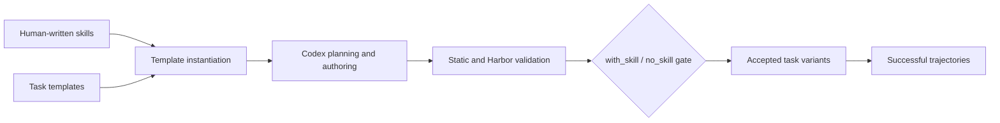

<div align="center">

<h1>🧠 SkillGym</h1>

<p><strong>Internalizing Large-Scale Human-Written Skills into LLMs for Real-World Problem Solving</strong></p>

<p><em>From human-written workflows to executable, verifiable training environments.</em></p>

<p>
  🤗 <a href="https://huggingface.co/datasets/ecnu-icalk/SkillGym">Dataset</a>
  &nbsp;·&nbsp;
  🤖 <a href="https://huggingface.co/ecnu-icalk/SkillGym-Agent">Model checkpoint</a>
  &nbsp;·&nbsp;
  🧰 <a href="task_builder/README.md">Task Builder</a>
  &nbsp;·&nbsp;
  🧭 <a href="task_builder/docs/task-generation-pipeline.md">Pipeline</a>
  &nbsp;·&nbsp;
  🚀 <a href="#quick-start">Quick start</a>
</p>

</div>

> **SkillGym** transforms human-written agent skills into executable environments, verifies outcomes with code, and collects successful long-horizon trajectories for training general-purpose agents.

## 📌 At a glance

<table>
  <tr>
    <td align="center">🏗️<br><strong>2,756</strong><br><sub>accepted environments</sub></td>
    <td align="center">🧪<br><strong>5,512</strong><br><sub>with-skill / no-skill variants</sub></td>
    <td align="center">🧵<br><strong>8,364</strong><br><sub>successful trajectories</sub></td>
    <td align="center">🗂️<br><strong>12 / 63</strong><br><sub>major / sub-categories</sub></td>
  </tr>
</table>

<p><sub>Counts are the current manuscript snapshot. Environments, variants, sampled trials, and trajectories are different units; see the <a href="assets/Internalizing_Large_Scale_Human_Written_Skills_into_LLMs_for_Real_World_Problem_Solving.pdf">manuscript PDF</a> for the evaluation protocol.</sub></p>

<p align="center">
  <a href="assets/skillgym_baseline.pdf">
    
  </a>
</p>

<p align="center"><em>Benchmark overview from the current manuscript. Click the figure to open the PDF version.</em></p>

## 🧩 Framework

<p align="center">
  <a href="assets/SkillGym.pdf">
    
  </a>
</p>

<p align="center"><em>SkillGym converts human-written skills into executable, verifiable environments, then samples successful trajectories across multiple harness-model combinations.</em></p>

## 📊 Experiments and paper

The results below are synchronized with the latest manuscript PDF. SkillGym-Agent is a full-parameter supervised fine-tuned Qwen3.5-35B-A3B model trained on successful SkillGym trajectories. GDPval-AA v2 is reported as Elo; Terminal-Bench 2.1 and SkillsBench v1.1 are reported as task success rates (%). Values in parentheses are absolute improvements over the same-harness base model.

### 📈 Controlled benchmark comparison

| Harness | Model | GDPval-AA v2 | Terminal-Bench 2.1 | SkillsBench v1.1 | SkillsBench v1.1 without skills |
| --- | --- | ---: | ---: | ---: | ---: |
| Codex | Qwen3.5-35B-A3B (base) | 942 | 10.11 | 5.33 | 0.69 |
| Codex | **SkillGym-Agent** | **979 (+37)** | **46.07 (+35.96)** | **33.02 (+27.69)** | **21.08 (+20.39)** |
| Claude Code | Qwen3.5-35B-A3B (base) | 974 | 39.33 | 23.34 | 12.13 |
| Claude Code | **SkillGym-Agent** | **1173 (+199)** | **58.43 (+19.10)** | **51.47 (+28.13)** | **26.81 (+14.68)** |

SkillGym-Agent improves every reported metric under both harnesses. Under Claude Code, the largest gain is **+199 GDPval-AA v2 Elo** and **+19.10 points on Terminal-Bench 2.1**. Under Codex, the largest gain is **+35.96 points on Terminal-Bench 2.1**. The skill-free scores are especially informative: SkillGym-Agent reaches **26.81%** under Claude Code and **21.08%** under Codex, exceeding the corresponding base models even when those base models are given external skills (23.34% and 5.33%).

### 🧱 Dataset scale and trajectory quality

| Measure | Latest manuscript result |
| --- | --- |
| Accepted environments | 2,756 across 12 major and 63 sub-categories |
| Acceptance groups | 1,081 Skill-Dep. (39.2%) and 1,675 Verifier-Passed fallback environments |
| Sampling outcome | 8,364 successful trajectories from 48,152 trials (17.4% overall success) |
| Deduplicated coverage | 2,302 unique tasks, all 12 major categories, and 62 of 63 sub-categories |
| Average successful trajectory | 49.0 tool calls, 63.4k logged text tokens, and 35.2 interaction steps |
| Longest observed trajectory | 350 tool calls, 342.9k logged text tokens, and 318 interaction steps |

The 17.4% trial-level success rate shows that the released trajectories are filtered successful executions rather than easy demonstrations. The long interaction lengths preserve action-observation sequences, verifier outcomes, and failure evidence that can support both supervised fine-tuning and future verifier-rewarded reinforcement learning.

### 🧪 Teacher and harness ablation

| Harness | Teacher setting | GDPval-AA v2 | Terminal-Bench 2.1 | SkillsBench v1.1 | Without skills |
| --- | --- | ---: | ---: | ---: | ---: |
| Codex | GPT-5.4 | 969 | 24.72 | 14.00 | 6.96 |
| Codex | Nex-N2-Pro | 1074 | 33.71 | 13.59 | 12.61 |
| Codex | GPT+Nex | 976 | 40.45 | 19.91 | 13.59 |
| Codex | **All Teachers** | **979** | **46.07** | **33.02** | **21.08** |
| Claude Code | DeepSeek V4 Pro | 1106 | 43.82 | 28.81 | 19.02 |
| Claude Code | GLM-5.2 | **1212** | 55.06 | 45.50 | 25.10 |
| Claude Code | DeepSeek+GLM | 1161 | 57.30 | 47.33 | **28.41** |
| Claude Code | **All Teachers** | 1173 | **58.43** | **51.47** | 26.81 |

Teacher mixing consistently improves execution-oriented metrics such as Terminal-Bench and skill-assisted SkillsBench. The strongest single teacher can still achieve the highest GDPval-AA v2 score, so teacher diversity improves capabilities unevenly rather than every metric at once. Pooling both harnesses benefits Codex particularly strongly: compared with GPT+Nex, All Teachers adds 5.62 Terminal-Bench points, 13.11 skill-assisted SkillsBench points, and 7.49 skill-free points.

### 🔍 What the results suggest

1. **Verified workflow experience transfers beyond prompt following.** Without inference-time skills, SkillGym-Agent beats the base model with skills under both harnesses, suggesting that training on verified action-observation sequences internalizes reusable procedural competence.
2. **External skills remain complementary.** The trained model performs better with skills than without skills, so internalized abilities do not make the original skill cards unnecessary.
3. **The gains cover multiple capabilities.** Improvements span professional artifact production, sustained terminal execution, and skill-assisted and skill-free task solving instead of concentrating on one benchmark.
4. **The data is long-horizon by construction.** Successful records average 49 tool calls and 63.4k logged text tokens, making the release relevant to planning, tool coordination, verification, and failure recovery.

### ⚠️ Evaluation notes

- The latest paper reports long-context full-parameter SFT with ms-swift/Megatron on 16 NVIDIA H200 GPUs. The repository releases the task builder, data, trajectories, and checkpoint, but does not yet include standalone training or full benchmark-reproduction scripts.
- Claude Code uses the same standard system prompt for the base and trained models. The Codex comparison uses the standard prompt for the base model and the no-applypatch prompt for SkillGym-Agent, so the Codex difference cannot be attributed to fine-tuning alone.
- Public reference scores use their reported harnesses, inference budgets, and runtime configurations; they provide context rather than strictly controlled head-to-head comparisons.
- Parenthesized values are absolute Elo or percentage-point gains, not relative percentage improvements.

See the [latest manuscript PDF](assets/Internalizing_Large_Scale_Human_Written_Skills_into_LLMs_for_Real_World_Problem_Solving.pdf) and the [benchmark figure](assets/skillgym_baseline.pdf) for complete tables, baselines, implementation details, and evaluation caveats.

## 🧭 Explore the release

| I want to… | Start here |
| --- | --- |
| 📖 Read the project overview | This page |
| 📦 Download published environments and trajectories | [HF dataset](https://huggingface.co/datasets/ecnu-icalk/SkillGym) |
| 🧰 Build new task environments | [Task Builder guide](task_builder/README.md) |
| 🧭 Understand the complete construction flow | [Task-generation pipeline](task_builder/docs/task-generation-pipeline.md) |
| 🤖 Download the released checkpoint | [SkillGym-Agent on Hugging Face](https://huggingface.co/ecnu-icalk/SkillGym-Agent) |
| 🗃️ Understand the data migration and archive layout | [Migration notes](docs/migration.md) |

## 🔄 How SkillGym works



1. **Represent skills.** Skills are organized into a taxonomy and stored as reusable skill cards.
2. **Instantiate tasks.** A template combines a skill with concrete inputs, runtime requirements, and a verification specification.
3. **Validate behavior.** Static checks, Harbor execution, oracle runs, and with-skill/no-skill comparisons identify valid environments.
4. **Collect demonstrations.** Multiple teacher and harness configurations produce successful long-horizon trajectories.

The strict skill-effect gate requires the with-skill run to pass while the no-skill run produces a valid reward failure. Other verifier-passed outcomes can be retained as fallback releases after repair budgets are exhausted. These labels describe construction-time checks; they are not guarantees for every later agent execution.

## 📦 Release contents

Large artifacts live in the companion [Hugging Face dataset](https://huggingface.co/datasets/ecnu-icalk/SkillGym) so that this GitHub repository stays focused on code, documentation, and lightweight figures.

| Artifact | Purpose | Where to get it |
| --- | --- | --- |
| `Tasks.tar.zst` | Published task-environment archive, including `Tasks/Skill-Dep` and `Tasks/Verifier-Passed` | [HF file](https://huggingface.co/datasets/ecnu-icalk/SkillGym/blob/main/Tasks.tar.zst) |
| `skill_library.tar.zst` | Input skill cards for task generation | [HF file](https://huggingface.co/datasets/ecnu-icalk/SkillGym/blob/main/skill_library.tar.zst) |
| `task_templates.tar.zst` | Input templates for task generation | [HF file](https://huggingface.co/datasets/ecnu-icalk/SkillGym/blob/main/task_templates.tar.zst) |
| `Trajectories/*.jsonl` | Eight successful trajectory collections grouped by harness, teacher, and result type | [HF directory](https://huggingface.co/datasets/ecnu-icalk/SkillGym/tree/main/Trajectories) |
| SkillGym-Agent | Released model checkpoint | [HF model](https://huggingface.co/ecnu-icalk/SkillGym-Agent) |

The archives and trajectory files are a data snapshot associated with GitHub commit `6ebabba`. The current GitHub code can evolve independently from that snapshot. File sizes and SHA-256 checksums are available from the corresponding Hugging Face file metadata.

<a id="quick-start"></a>
## 🚀 Quick start

### 1. Check the builder

```bash
git clone https://github.com/ECNU-ICALK/SkillGym.git
cd SkillGym

npm --prefix task_builder ci
npm --prefix task_builder run check
```

### 2. Download the builder inputs

This downloads the skill cards and templates needed by `task_builder`. It does not download the 9 GB published task archive.

```bash
python -m pip install -U huggingface_hub
hf auth login

hf download ecnu-icalk/SkillGym \
  skill_library.tar.zst task_templates.tar.zst \
  --repo-type dataset --local-dir .hf/skillgym

tar --zstd -xf .hf/skillgym/skill_library.tar.zst
tar --zstd -xf .hf/skillgym/task_templates.tar.zst
```

### 3. Download published environments (optional)

```bash
hf download ecnu-icalk/SkillGym Tasks.tar.zst \
  --repo-type dataset --local-dir .hf/skillgym

tar --zstd -xf .hf/skillgym/Tasks.tar.zst
```

### 4. Generate a task family

The full command, configuration variables, repair budgets, runtime requirements, and output semantics are documented in the [Task Builder guide](task_builder/README.md). A minimal example is:

```bash
cd task_builder

npm run generate-family -- \
  --template-root ../task_templates \
  --template development/frontend/seed_task \
  --skill-dir ../skill_library/development/frontend/skills/tailwind-design-system \
  --skill-mode per-skill \
  --task-count 1 \
  --output-root /tmp/skillgym-output \
  --concurrency 1
```

A generation run may take hours and can invoke paid model and sandbox services. Installing npm dependencies alone does not provision Harbor, a runtime, or model credentials.

## 📚 Citation

The final arXiv link and BibTeX entry will be added with the paper release.

## ⚖️ License

See [LICENSE](LICENSE) for the repository license. Source skills and supporting materials retain their applicable upstream notices; this documentation refactor does not change their licensing or provenance.
